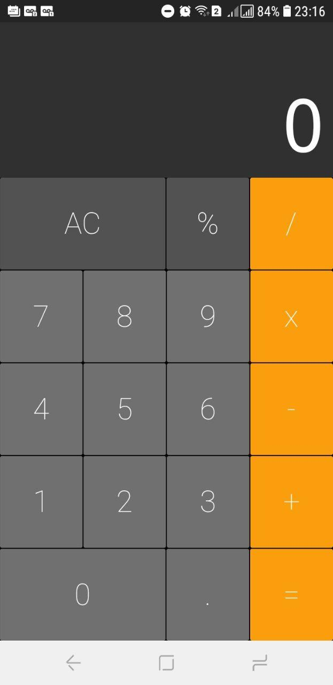

<!-- então bora codar! -->

<h1 align="center">
    
</h1>

<h2 align="center"> Android calculator made mac style</h2>

<h3 align="center"> Created with  Flutter </h3>

## Screen

    

<h4 align="center"> <em>&lt;/&gt;</em> by DeveloperMattos</h4>
